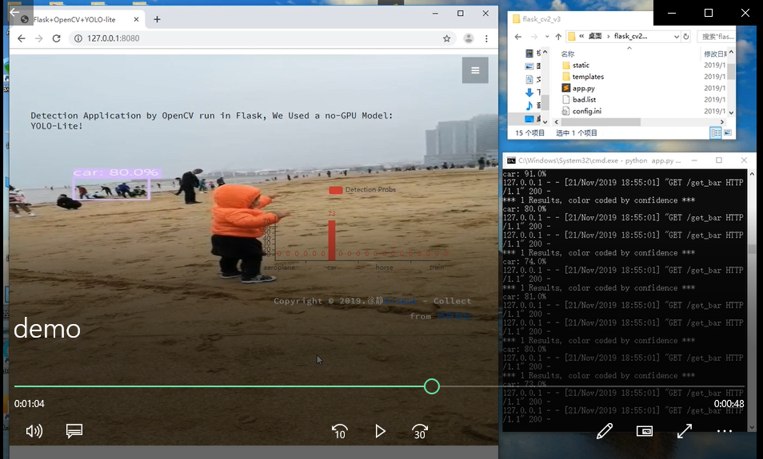

## Flask OpenCV and Object Detection

## 将OpenCV视频传输到网页浏览器并进行目标检测

**Xu Jing**

### 1. 功能实现

+ 基于Flask搭建一个Web服务；
+ 将openCV视频流同步传输到Web网页；
+ 对视频流中的帧进行目标检测(YOLO-lite)并基于pyecharts进行实时可视化；


### 2. 项目目录

<details>
<summary><mark><font color=darkred>点我查看</font></mark></summary>
<pre><code>
│  app.py  # Flask app
│  config.ini  # 配置文件
│  pthreadGC2.dll   #yolo-lite darknet动态链接库
│  pthreadVC2.dll   #yolo-lite darknet动态链接库
│  README.md  
│  requirement.txt   # 环境需要的package
│  run_app.bat       # 批处理文件
│  yolo_cpp_dll.dll  #yolo-lite darknet动态链接库 GPU
│  yolo_cpp_dll_no_gpu.dll #yolo-lite darknet动态链接库 CPU
│
├─model  # 模型及配置文件
│      tiny-yolov2-trial13-noBatch.cfg
│      tiny-yolov2-trial13_noBatch.weights
│      voc.data
│      voc.names
│
├─static  # 静态资源文件
│  ├─css
│  │      bootstrap.css
│  │      font-awesome.min.css
│  │      style.css
│  │
│  ├─fonts
│  │      fontawesome-webfont.eot
│  │      fontawesome-webfont.svg
│  │      fontawesome-webfont.ttf
│  │      fontawesome-webfont.woff
│  │      fontawesome-webfont.woff2
│  │      FontAwesome.otf
│  │      Microsoft-Yahei-UI-Light.ttc
│  │
│  ├─images
│  │      1.jpg
│  │
│  └─js
│          echarts.min.js
│          jquery-3.4.1.min.js
│
└─templates  # 模板文件
        index.html
</code></pre>
</details>

运行项目需要环境：

+ python 3.6 或 python 3.7
+ pip install -r requirement.txt

运行程序：

```shell
python app.py --ip 0.0.0.0 --port 8080
```

或

```shell
run_app.bat
```


### 3.演示

(https://v.qq.com/txp/iframe/player.html?vid=r3024vzzzsp)
<!-- src="https://v.qq.com/txp/iframe/player.html?vid=r3024vzzzsp" -->


### 4.TODO

1. 训练更复杂的目标检测模型： SSD,RetinaNet,YOLOV3, or Anchor Free...；
2. Nigix部署该Web服务；